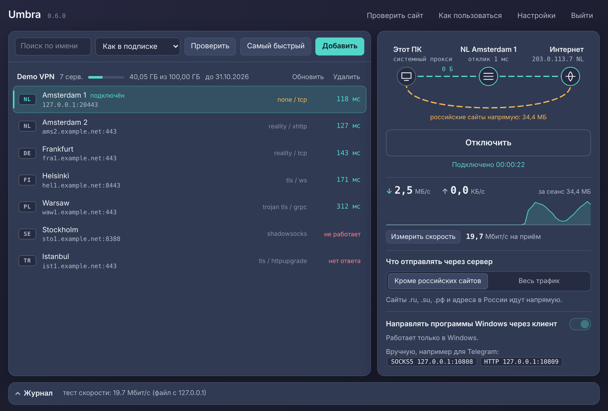
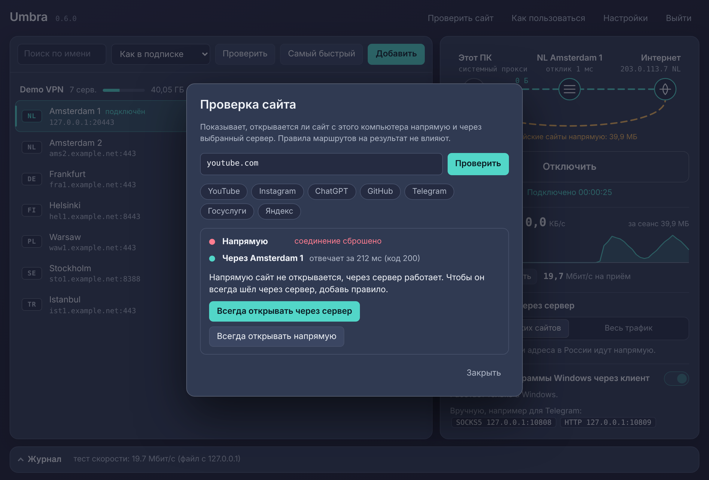
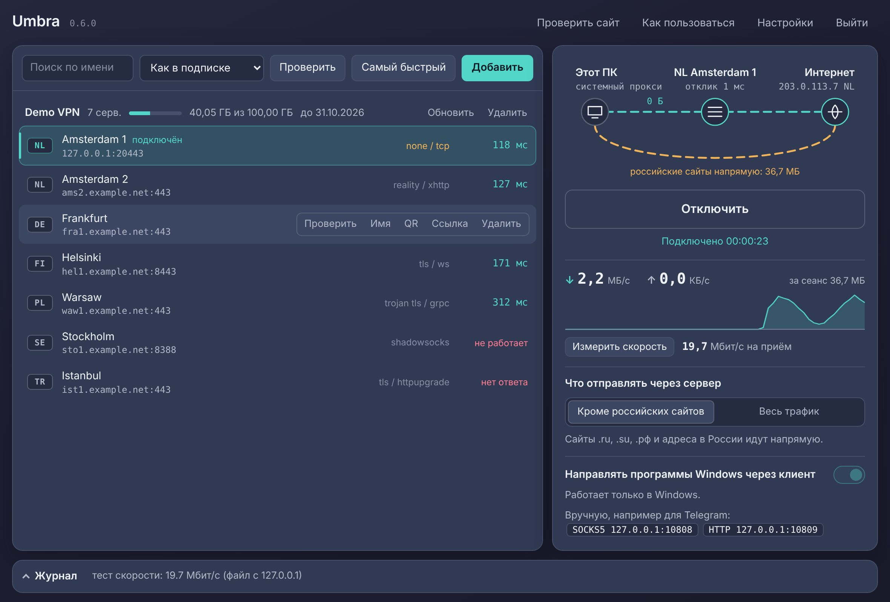
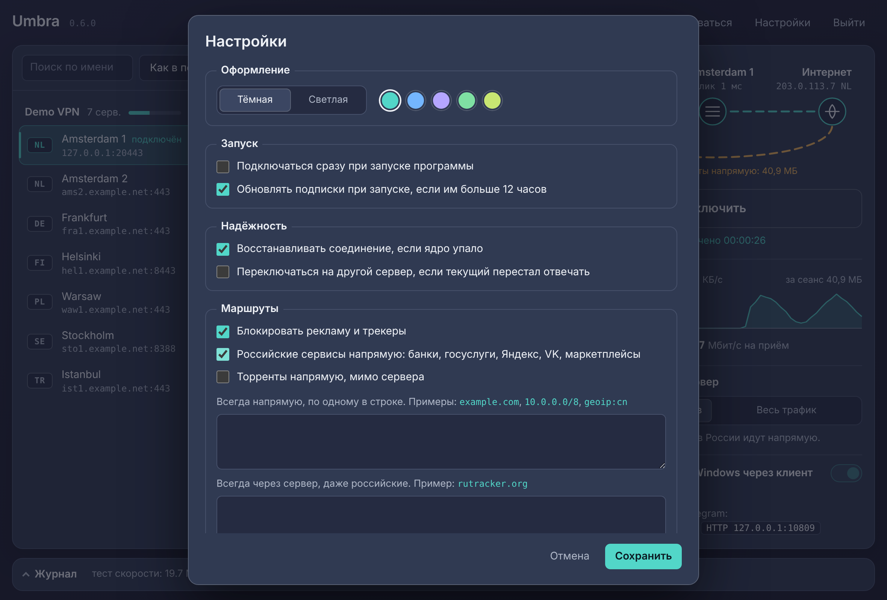
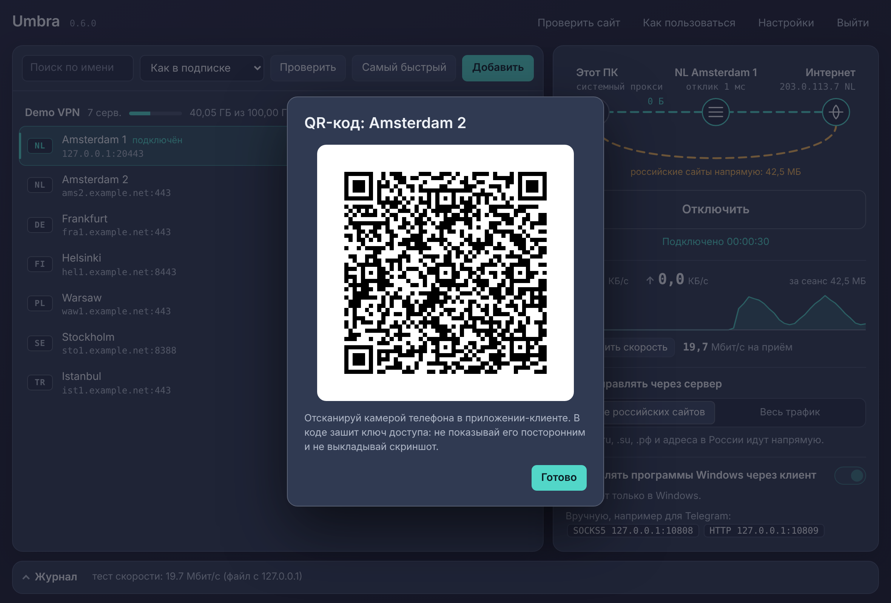
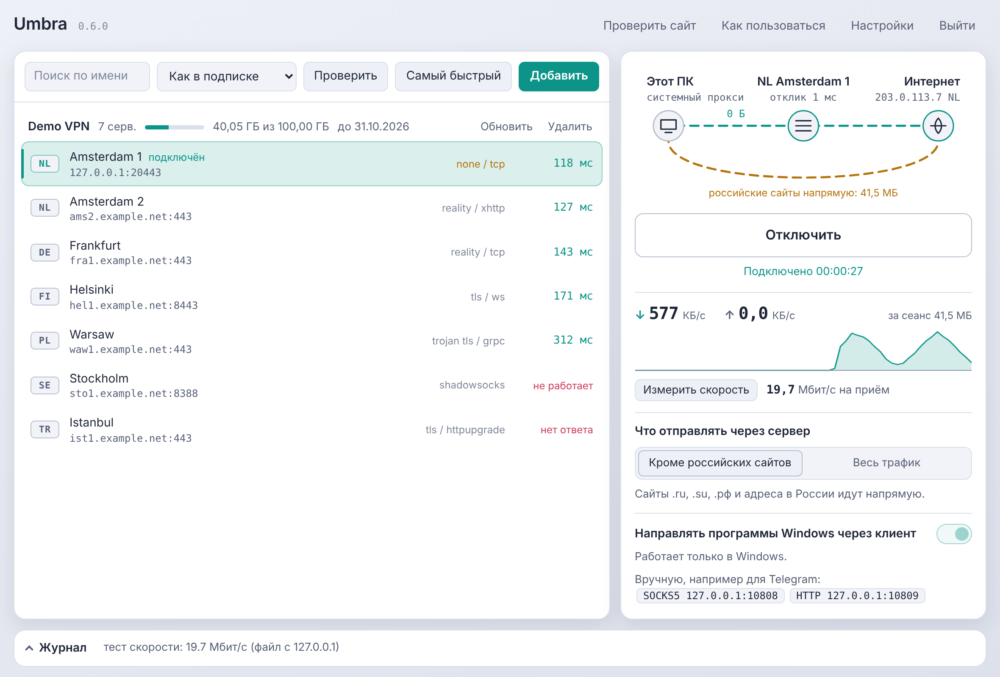
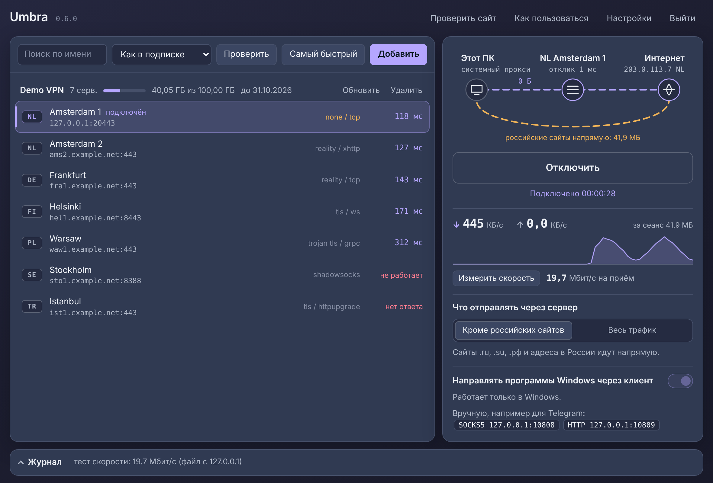

# Umbra

Клиент для VLESS, Trojan, Shadowsocks и VMess под Windows. Внутри [Xray-core](https://github.com/XTLS/Xray-core), сверху понятный интерфейс: схема показывает, какой трафик идёт через сервер, а какой напрямую.

*A Windows GUI client for VLESS, Trojan, Shadowsocks and VMess built around Xray-core. The interface is in Russian.*



## Скачать

**[Последняя версия](https://github.com/salilov95/Umbra/releases/latest)**

| Файл | Для кого |
|---|---|
| `Umbra-Setup-x.y.z.exe` | Установщик: ярлыки, удаление через «Приложения» Windows. Права администратора не нужны |
| `Umbra.exe` | Один файл без установки: положил в любую папку и запустил |
| `SHA256SUMS.txt` | Контрольные суммы обоих файлов |

Нужен Windows 10 или 11 с Edge или Chrome: окно программы открывается через них.

Файлы не подписаны сертификатом, поэтому при первом запуске Windows покажет «Система Windows защитила ваш компьютер». Нажми «Подробнее», затем «Выполнить в любом случае». Антивирус может ругаться на сам файл (ложное срабатывание на сборки PyInstaller) и на `xray.exe`.

## Как пользоваться

1. Скопируй ссылку на сервер (`vless://`, `trojan://`, `ss://`, `vmess://`) или адрес подписки и нажми Ctrl+V прямо в окне.
2. Нажми «Проверить»: программа измерит время запроса через каждый сервер. «Самый быстрый» выберет лучший сам.
3. Щелчок выбирает сервер, двойной щелчок подключает.
4. Посмотри на схему: бирюзовая линия показывает трафик через сервер, янтарная показывает трафик напрямую. Под «Интернет» виден адрес, под которым тебя видят сайты.

При первом подключении программа сама скачает ядро Xray (около 20 МБ) и сверит контрольную сумму. Закрытие окна сворачивает программу в трей возле часов; выйти можно из меню значка.

## Возможности

| | |
|---|---|
| Протоколы | VLESS (Reality, TLS), Trojan, Shadowsocks (AEAD и 2022), VMess; транспорты TCP, WebSocket, gRPC, XHTTP, HTTPUpgrade |
| Подписки | обычные и base64; название, остаток трафика и срок действия, если панель их отдаёт; автообновление |
| Проверка серверов | время запроса через туннель каждого сервера, без разрыва текущего соединения |
| Маршруты | «кроме российских сайтов» или «весь трафик», свои списки, готовые наборы: блокировка рекламы, российские сервисы напрямую, торренты напрямую |
| Проверка сайта | открывается ли сайт напрямую и через сервер, с кнопкой «всегда через сервер» |
| Контроль | скорость и объём в реальном времени, проверка туннеля каждые 20 секунд, выходной IP, тест скорости |
| Надёжность | восстановление при обрыве, переключение на другой сервер, возврат настроек прокси Windows даже после сбоя |
| Удобство | трей и уведомления, автозапуск, QR-код для переноса сервера на телефон, тёмная и светлая темы |

## Скриншоты

Сняты на демонстрационных данных на тестовом стенде, поэтому адреса и цифры условные.

| | |
|---|---|
|  Проверка сайта двумя путями |  Действия с сервером |
|  Настройки и готовые наборы правил |  QR-код для телефона |
|  Светлая тема |  Другой акцентный цвет |

## Безопасность

- **Прокси Windows.** Прежние значения сохраняются до изменения и возвращаются при отключении, выходе и при следующем запуске после сбоя.
- **Ядро.** Архив Xray принимается только при совпадении SHA-256 с файлом `.dgst` из того же релиза.
- **Локальный интерфейс.** Сервер слушает только `127.0.0.1`. Каждый запрос проверяется по случайному токену и заголовкам `Host` и `Origin`. Ключи серверов и адрес подписки в интерфейс не передаются; ссылка с ключом выдаётся только по кнопкам «Ссылка» и «QR».
- **Куда программа обращается.** GitHub (ядро и проверка новой версии), адрес твоей подписки, через туннель `gstatic.com/generate_204` (проверка связи) и `cloudflare.com/cdn-cgi/trace` (выходной IP). По кнопке «Измерить скорость» скачивается тестовый файл с одного из четырёх публичных хостов. Телеметрии нет.
- **Обновления.** Программа только сообщает о новой версии и открывает страницу загрузки. Сама она ничего не скачивает и не заменяет.

## Ограничения

- Работает через системный прокси, без TUN: программы, которые игнорируют прокси Windows, идут мимо. Им можно указать адрес SOCKS5 вручную (`127.0.0.1:10808`).
- Не поддерживаются Hysteria2, TUIC, WireGuard, Shadowsocks с плагинами и зашифрованные подписки `happ://crypt…`.
- Только Windows.

## Запуск из исходников

Нужен Python 3.10 или новее. Сторонние библиотеки не нужны.

```
git clone https://github.com/salilov95/Umbra.git
cd Umbra
run.bat
```

Сборка своими руками:

| Скрипт | Что делает |
|---|---|
| `build_exe.bat` | собирает `dist\Umbra.exe` через PyInstaller |
| `build_installer.bat` | собирает установщик; нужен [Inno Setup 6](https://jrsoftware.org/isdl.php) |
| `restore_proxy.bat` | возвращает прокси Windows, если после сбоя пропал интернет |

Данные программы лежат в `%APPDATA%\Umbra`. Если рядом с `Umbra.exe` создать пустую папку `data`, всё будет храниться в ней: так программу можно носить на флешке.

## Как устроено

| Файл | Назначение |
|---|---|
| `umbra/links.py` | разбор ссылок на серверы |
| `umbra/xrayconf.py` | сборка конфигурации Xray и правил маршрутизации |
| `umbra/core.py` | загрузка, проверка и запуск ядра |
| `umbra/controller.py` | логика: подключение, проверки, подписки |
| `umbra/server.py` | локальный HTTP-сервер для интерфейса |
| `umbra/sysproxy.py`, `tray.py`, `autostart.py` | прокси Windows, значок в трее, автозапуск |
| `umbra/qr.py` | генератор QR-кодов |
| `umbra/web/` | интерфейс: HTML, CSS, JavaScript |

## Тесты

```
python -m unittest discover -s tests -t .
```

Каждая отправка в репозиторий запускает тесты и сборку на Windows в GitHub Actions. Сквозные тесты с настоящим Xray (трафик через локальные серверы всех четырёх протоколов) рассчитаны на Linux и включаются переменной `XRAY_DIR`.

Выпуск версии: поменять номер в `umbra/__init__.py`, создать релиз с тегом вида `v0.6.1`. Сборка сама приложит к нему exe и установщик.

## Автор и обратная связь

Автор: [@salilov95](https://github.com/salilov95). Нашёл ошибку или хочешь предложить функцию — создай [issue](https://github.com/salilov95/Umbra/issues).

## Лицензия

Код Umbra распространяется по лицензии MIT, см. файл `LICENSE`.

Ядро [Xray-core](https://github.com/XTLS/Xray-core) в репозиторий не входит: программа скачивает его с официальной страницы релизов. У него своя лицензия, MPL-2.0. Если раздаёшь сборку с папкой `core`, вместе с ней должен оставаться файл `LICENSE` из архива Xray.
